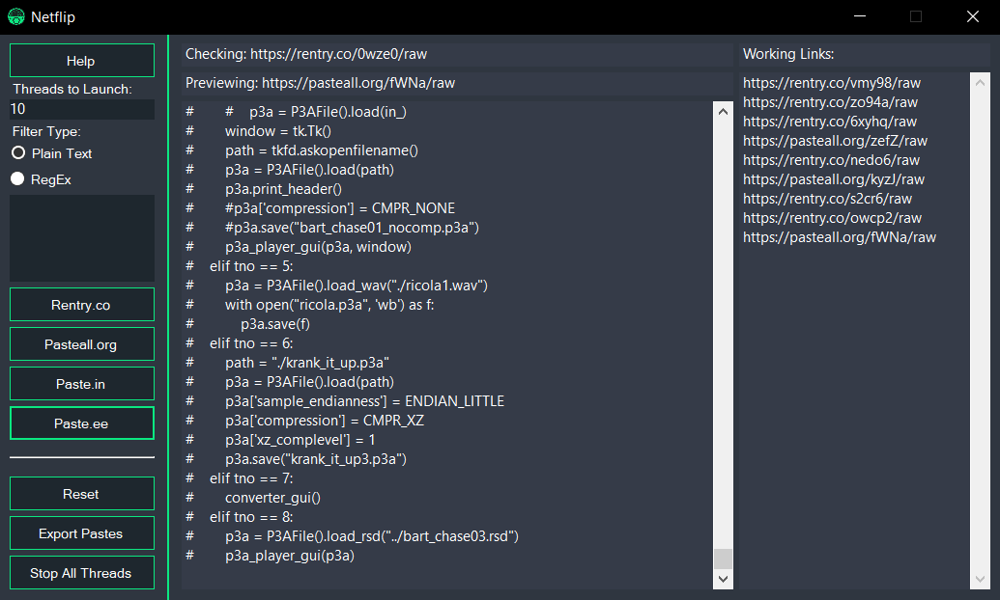

  
  <h1 align="center">Netflip</h1>
  

    
     
    Scrape paste sites for sensitive information.  
      
    <strong>DISCLAIMER:</strong> It's the end user's responsibility to obey all applicable local, state, and federal laws. Developers assume no liability and are not responsible for any misuse or damage caused by this program. By using netflip, you agree to the previous statements.
  
 

  <strong>Usage</strong> 
  Netflip is extremely simple to use. Simply open the .SLN file using Visual Studio 2019, build the source code, and run! Start scraping by clicking on one or more of the paste sites. 

