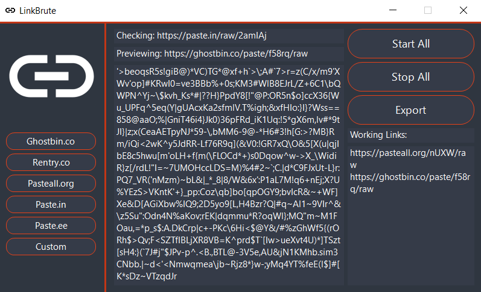

 

# netflip
Not very pretty code -> This project is just a proof of concept.
**THIS PROJECT IS NO LONGER MAINTAINED**

### Brute force links on paste sites.

**DISCLAIMER:** It's the end user's responsibility to obey all applicable local, state, and federal laws. Developers assume no liability and are not responsible for any misuse or damage caused by this program. By using netflip, you agree to the previous statements.

## Sites
- Ghostbin.co
- Rentry.co
- Pasteall.org
- Paste.in
- Paste.ee

## Usage
In the netflip application, click on any site in order to launch. You can run multiple sites at a time. Click the *Stop All* button to terminate all threads.

## Coming Soon
- Start All Button
- Custom Sites
- Export Working Links
