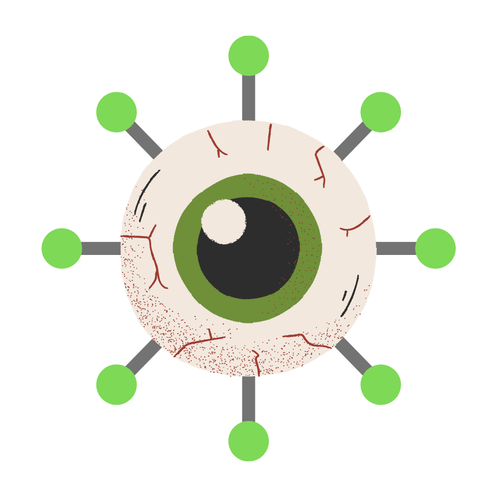

  
  <h1 align="center">Netflip</h1>
  

    
    
     
    Scrape paste sites for sensitive information. 
    (Updated version of <a href="https://github.com/audioo/netflip-old">this.</a>)
</a>
  
 

## Table of Contents

- [Information](#information)
  - [About](#about)
  - [Disclaimer](#disclaimer)
  - [Preview](#preview)
  - [Attributions](#attributions)

## Information

### About

Netflip is a tool that enables a user/individual to scrape paste sites in bulk for sensitive information. This is a revisioned version of [this repository](https://github.com/ax-i-om/netflip-old), designed to be lightweight and cross-platform.

### Disclaimer

It is the end user's responsibility to obey all applicable local, state, and federal laws. Developers assume no liability and are not responsible for any misuse or damage caused by this program. By using Netflip, you agree to the previous statements.

### Todo

- [ ] Custom modules
- [ ] Custom configurations
- [ ] Export results as ...
- [ ] Proxylist support
- [ ] Concurrent searching

### Preview

<a><video src="https://user-images.githubusercontent.com/blahblahs.mp4"></a>

### Attributions

[Social Preview](./images/card.jpg) created with [Canva.](https://www.canva.com/)
